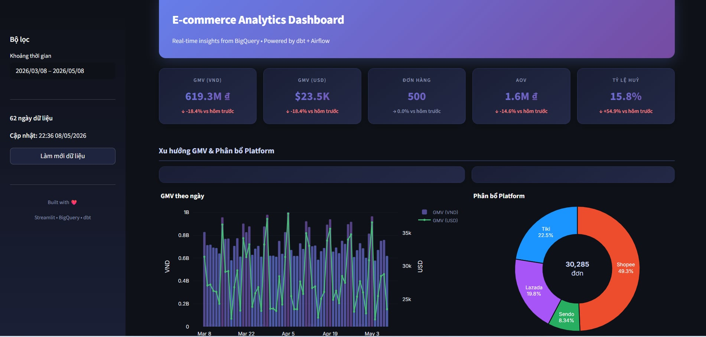
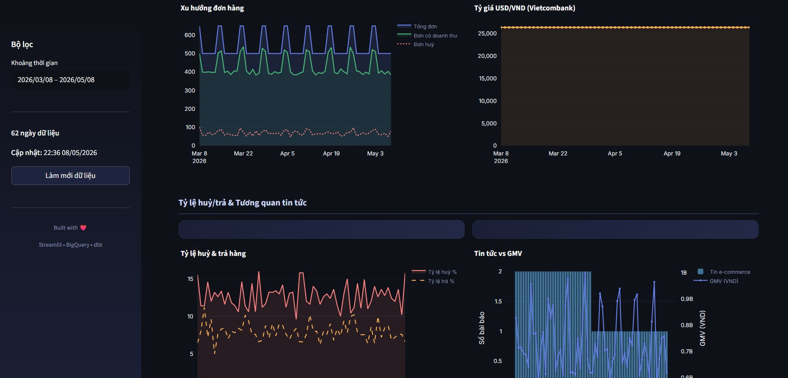

# E-commerce Data Platform

An end-to-end data platform for e-commerce analytics, built with **Airflow + dbt + BigQuery + Streamlit** to:
- ingest daily data from multiple sources,
- transform data through `raw -> staging -> marts`,
- deliver business insights via an interactive dashboard.

## Project Goals

- Automate a daily data pipeline.
- Build `fact_daily_summary` for GMV, order volume, cancellation rate, and platform mix analysis.
- Provide a clear dashboard for business and data teams.

## High-Level Architecture

1. **Ingestion (Airflow DAG)**  
   - USD/VND exchange rates (Vietcombank XML API)  
   - E-commerce news (RSS)  
   - Synthetic transactions (Faker + Vietnam market business rules)
2. **Storage (GCS + BigQuery raw external tables)**  
   - Parquet files are uploaded to GCS and queried through BigQuery external tables.
3. **Transformation (dbt)**  
   - `staging`: clean, rename, and cast fields  
   - `marts`: business KPI model (`fact_daily_summary`)
4. **Visualization (Streamlit + Plotly)**  
   - KPI dashboard for GMV trend, order trend, cancellation rate, and platform breakdown

## Tech Stack

- Python 3.x
- Apache Airflow (Astronomer Runtime)
- dbt + dbt-bigquery
- Google Cloud Storage (GCS)
- BigQuery
- Streamlit + Plotly

## Project Structure

```text
ecommerce-data-platform/
|- airflow/
|  |- dags/ecommerce_daily_pipeline.py
|  |- include/data_ingestion/
|  |- dbt_project/
|  |- Dockerfile
|  |- requirements.txt
|- dashboard/
|  |- app.py
|  |- requirements.txt
|- setup/
|  |- create_bigquery_datasets.py
|  |- create_external_tables.py
|- .env
|- requirements.txt
|- README.md
```

## Prerequisites

- Installed:
  - Python 3.10+ (recommended)
  - Docker Desktop
  - Astronomer CLI (`astro`)
- Available:
  - A GCP project
  - A service account with BigQuery + GCS permissions
  - Service account key JSON (e.g., `gcp-credentials.json`)
  - A GCS bucket for raw parquet files

## Environment Configuration

Create a `.env` file in the project root:

```env
GCP_PROJECT_ID=your-gcp-project-id
GCS_BUCKET_NAME=your-gcs-bucket
GOOGLE_APPLICATION_CREDENTIALS=gcp-credentials.json
```

Place `gcp-credentials.json` in the project root (or update paths accordingly).

## Initial Setup

### 1) Install Python dependencies (setup scripts)

```bash
pip install -r requirements.txt
```

### 2) Create BigQuery datasets

```bash
python setup/create_bigquery_datasets.py
```

This creates:
- `raw`
- `staging`
- `marts`

### 3) Create BigQuery external tables

```bash
python setup/create_external_tables.py
```

External tables:
- `raw.transactions`
- `raw.exchange_rate`
- `raw.news`

## Run Airflow Pipeline Locally (Astro)

From the `airflow/` directory:

```bash
astro dev start
```

When containers are ready:
- Airflow UI: [http://localhost:8080](http://localhost:8080)
- DAG: `ecommerce_daily_pipeline`

DAG flow:
`ingest_exchange_rate -> ingest_news -> ingest_transactions -> dbt_run_staging -> dbt_run_marts -> dbt_test -> check_data_quality -> (alert_missing_data | pipeline_success)`

## Run Dashboard

From the `dashboard/` directory:

```bash
pip install -r requirements.txt
streamlit run app.py
```

The dashboard reads from:
- `marts.fact_daily_summary`
- `staging.stg_transactions` (drill-down)

## Dashboard Preview




## Main dbt Models

- `staging/stg_transactions.sql`
- `staging/stg_exchange_rate.sql`
- `staging/stg_news.sql`
- `marts/fact_daily_summary.sql`

Tests are defined in:
- `models/staging/sources.yml`
- `models/marts/marts.yml`

## Security Notes for GitHub

- **Do not commit** files containing credentials/secrets:
  - `.env`
  - `gcp-credentials.json`
- Ensure `.gitignore` includes these files.
- If needed, add an `env.example` file with placeholder values.

## Quick Troubleshooting

- `Cannot connect to BigQuery`:
  - Check `GOOGLE_APPLICATION_CREDENTIALS` and service account permissions.
- `DAG fails at dbt step`:
  - Check `profiles.yml`, project ID, dataset names, and keyfile path.
- `Dashboard has no data`:
  - Trigger the DAG and verify records exist in `marts.fact_daily_summary`.

## Future Improvements

- Add CI/CD (lint, DAG tests, dbt tests) with GitHub Actions.
- Add full Slack/Teams alerting for failures and SLA misses.
- Add dashboard views for pipeline health monitoring.

---

